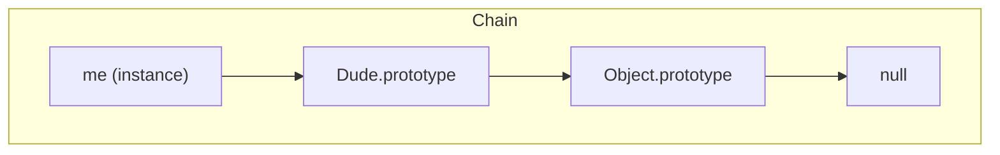

# 📘 Ringkasan Video: Prototypes and the Prototype Chain (Episode 2)
### Siri: *10 Things JavaScript Developers Should Know*

---

## 🎯 Ringkasan Utama
Video ini menerangkan konsep **prototype**, **`__proto__`**, dan **prototype chain** dalam JavaScript — iaitu asas kepada sistem pewarisan (*inheritance*) dalam bahasa tersebut.

---

## 🧩 1. Pengenalan
- Semua objek dalam JavaScript mempunyai satu properti khas bernama **`__proto__`**.
- Ia menunjuk kepada **objek lain** yang menjadi “ibu bapa” atau *prototype* bagi objek tersebut.
- Contohnya, objek kosong `{}` masih mempunyai properti seperti `toString()` dan `valueOf()` kerana ia mewarisinya daripada `Object.prototype`.

---

## 🧱 2. Apa Itu `__proto__`
`__proto__` ialah **rujukan dalaman** kepada *prototype* yang diwarisi.

Apabila kita akses sesuatu property:
1. JavaScript cari property dalam objek itu sendiri.
2. Jika tiada, ia naik ke **`__proto__`** (objek induk).
3. Teruskan mencari ke atas hingga ke `Object.prototype`.
4. Jika tiada di mana-mana, pulangkan `undefined`.

Contoh:
```js
const dude = {};
console.log(dude.toString); // Diperoleh daripada Object.prototype
```

---

## 🔗 3. Prototype Chain
Setiap jenis objek (Array, String, Function, dsb.) mempunyai *prototype chain* tersendiri:

```
myArray → Array.prototype → Object.prototype → null
myString → String.prototype → Object.prototype → null
```

Inilah sebabnya:
- `Array` mempunyai method seperti `push()` atau `map()`.
- `String` mempunyai method seperti `slice()` atau `toUpperCase()`.

---

## 🧬 4. Pewarisan Manual (`Object.create`)
Kita boleh buat pewarisan sendiri secara manual:

```js
const human = { kind: "human" };
const cena = Object.create(human);
cena.age = 34;
```

Rantaian pewarisan:
```
cena → human → Object.prototype
```

Jika buat lagi:
```js
const ben = Object.create(cena);
```
Maka rantainya:
```
ben → cena → human → Object.prototype
```

---

## 🧑‍🏫 5. Pewarisan Dengan Class dan Constructor
Menggunakan `class`:
```js
class Human {
  talk() { return "Talking"; }
}

class SuperHuman extends Human {
  fly() { return "Flying"; }
}

const ben = new SuperHuman();
```

- `ben` boleh guna `fly()` dan `talk()`.
- Jika method tiada, JS akan mencari ke atas prototype chain.

---

## 🧰 6. Beza Antara `__proto__` dan `.prototype`

| Konsep | Dimiliki oleh | Fungsi |
|--------|---------------|--------|
| `__proto__` | Instance (objek sebenar) | Rujuk ke parent prototype |
| `.prototype` | Constructor function / Class | Simpan method yang diwarisi oleh semua instance |

Contoh:
```js
function Dude(name) {
  this.name = name;
}

Dude.prototype.talk = function() {
  return "Talking!";
};

const me = new Dude("Cena");

console.log(me.__proto__ === Dude.prototype); // true
```

> **Kesimpulan:**  
> `__proto__` ialah sambungan dari instance ke parent-nya,  
> manakala `.prototype` ialah koleksi method yang diwarisi oleh semua instance daripada constructor.

---

## 🪄 7. Kesimpulan Akhir
- `prototype` dan `__proto__` ialah dua sisi kepada mekanisme pewarisan yang sama.
- Semua objek dalam JavaScript terhubung dalam satu **prototype chain**.
- Jika property tidak dijumpai, JS akan “memanjat” rantai tersebut hingga ke `Object.prototype`, dan akhirnya memulangkan `undefined`.

---

## 🧠 Petikan Akhir Video
> “They’re exactly the same thing but accessed from different ends.”  
> “Hopefully that settles it!”

---

## 🗺️ Rajah Konsep (Mermaid)


---

## 📚 Intipati Pembelajaran
- Semua objek dalam JavaScript **mewarisi** daripada objek lain.
- `__proto__` digunakan semasa runtime untuk pencarian property.
- `.prototype` digunakan untuk menentukan apa yang diwarisi oleh objek baru yang dicipta dengan `new`.
- Rantai pewarisan berakhir pada `Object.prototype`.

---

**Video:** *“Prototypes and the Prototype Chain — Episode 2”*  
**Siri:** *10 Things JavaScript Developers Should Know*  
**Durasi:** ±15 minit  
**Topik Seterusnya:** Constructor Functions (Episode 3)
